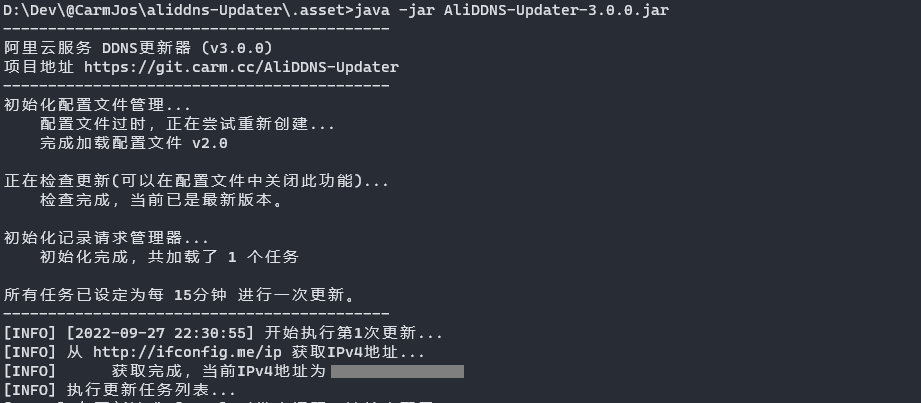

# 阿里云DDNS更新器


[](https://opensource.org/licenses/GPL-3.0)


阿里云服务，域名DDNS更新器，支持IPV6。

## 使用方法

下载后，放到单独的文件夹内，在控制台中执行以下命令即可运行。

```shell
java -jar aliddns-updater-<version>.jar
```

执行后，您应当看到以下内容输出：



## 配置文件示例

关于请求的具体配置内容请参考 [请求配置](.doc/REQUEST.md) 。

```yaml
# 配置文件版本，请不要修改。
version: 2.0

# 是否输出域名记录查询返回信息。(用于调试)
debug: false

service:
  # 更新间隔,单位为秒。
  period: 900
  # 阿里云接口地域ID，可以不改动。
  # 请参考 https://help.aliyun.com/knowledge_detail/40654.html
  region-id: cn-hangzhou

# 本机IP查询接口配置。
# 用于获取对应的IP地址，以更新到域名记录。
query:
  # IPv4地址获取链接
  v4: http://ifconfig.me/ip
  # IPv6地址获取链接 (可选)
  # 如不需要IPV6，则可以直接将地址留空。
  v6: https://v6.ip.zxinc.org/getip

# 更新任务配置。
# 具体配置请参考 https://github.com/CarmJos/AliDDNS-Updater/blob/master/.doc/REQUEST.md
requests:
  demo:
    domain: example.com
    record: '@'
    ipv6: false
    access-key: YOUR-ACCESS-KEY
    access-secret: YOUR-ACCESS-SECRET
```

## 视频教程

您可以 [点击这里](https://www.bilibili.com/video/BV1t54y147aQ) 查看由开发者本人制作的简易视频讲解。

## 守护进程示例

### Linux systemd

请参考 [systemd自启动java程序](https://www.cnblogs.com/yoyotl/p/8178363.html) 。

### Windows Service

请参考 [windows环境下批处理实现守护进程](https://blog.csdn.net/qin9r3y/article/details/22805095)

## 开源协议

本项目源码采用 [GNU General Public License v3.0](https://opensource.org/licenses/GPL-3.0) 开源协议。

<details>
<summary>关于 GPL 协议</summary>

> GNU General Public Licence (GPL) 有可能是开源界最常用的许可模式。GPL 保证了所有开发者的权利，同时为使用者提供了足够的复制，分发，修改的权利：
>
> #### 可自由复制
> 你可以将软件复制到你的电脑，你客户的电脑，或者任何地方。复制份数没有任何限制。
> #### 可自由分发
> 在你的网站提供下载，拷贝到U盘送人，或者将源代码打印出来从窗户扔出去（环保起见，请别这样做）。
> #### 可以用来盈利
> 你可以在分发软件的时候收费，但你必须在收费前向你的客户提供该软件的 GNU GPL 许可协议，以便让他们知道，他们可以从别的渠道免费得到这份软件，以及你收费的理由。
> #### 可自由修改
> 如果你想添加或删除某个功能，没问题，如果你想在别的项目中使用部分代码，也没问题，唯一的要求是，使用了这段代码的项目也必须使用
> GPL 协议。
>
> 需要注意的是，分发的时候，需要明确提供源代码和二进制文件，另外，用于某些程序的某些协议有一些问题和限制，你可以看一下
> @PierreJoye 写的 Practical Guide to GPL Compliance 一文。使用 GPL 协议，你必须在源代码代码中包含相应信息，以及协议本身。
>
> *以上文字来自 [五种开源协议GPL,LGPL,BSD,MIT,Apache](https://www.oschina.net/question/54100_9455) 。*

</details>